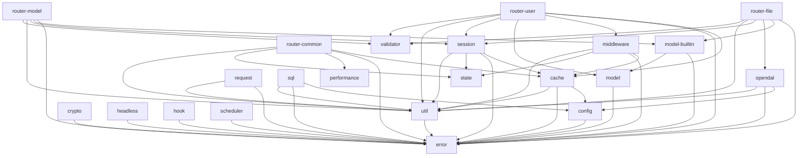

# tibba modules

```mermaid
graph TD
    config --> error

    crypto --> error

    headless --> error

    hook --> error

    model --> error

    scheduler --> error

    util --> error

    model-builtin --> error
    model-builtin --> model

    cache --> config
    cache --> error
    cache --> util

    opendal --> config
    opendal --> error
    opendal --> util

    request --> error
    request --> util

    sql --> config
    sql --> error
    sql --> util

    middleware --> cache
    middleware --> error
    middleware --> state
    middleware --> util

    router-common --> cache
    router-common --> error
    router-common --> performance
    router-common --> state
    router-common --> util

    session --> cache
    session --> error
    session --> state
    session --> util

    router-file --> error
    router-file --> model-builtin
    router-file --> opendal
    router-file --> session
    router-file --> util
    router-file --> validator

    router-model --> error
    router-model --> model-builtin
    router-model --> session
    router-model --> util
    router-model --> validator

    router-user --> cache
    router-user --> error
    router-user --> middleware
    router-user --> model
    router-user --> session
    router-user --> util
    router-user --> validator
```