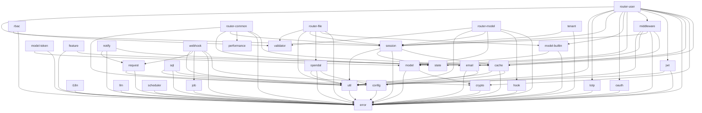

# tibba modules

Workspace 内 `tibba-*` crate 的 path 依赖关系（由 `cargo run --bin generate-mermaid` 生成）。

更新：

```bash
make mermaid
# 或
cargo run --bin generate-mermaid
```


```mermaid
graph TD
    config --> error

    crypto --> error

    hook --> error

    i18n --> error

    job --> error

    llm --> error

    oauth --> error

    scheduler --> error

    totp --> error

    util --> error

    email --> config
    email --> error

    model --> crypto
    model --> error

    cache --> config
    cache --> error
    cache --> util

    jwt --> error
    jwt --> util

    opendal --> config
    opendal --> error
    opendal --> util

    request --> error
    request --> util

    sql --> config
    sql --> error
    sql --> util

    model-builtin --> error
    model-builtin --> model

    model-token --> error
    model-token --> model

    feature --> cache
    feature --> error

    session --> cache
    session --> error
    session --> state
    session --> util

    notify --> email
    notify --> error
    notify --> request

    webhook --> crypto
    webhook --> error
    webhook --> job
    webhook --> request
    webhook --> util

    middleware --> cache
    middleware --> error
    middleware --> session
    middleware --> state
    middleware --> util

    rbac --> error
    rbac --> session

    router-common --> cache
    router-common --> error
    router-common --> performance
    router-common --> session
    router-common --> state
    router-common --> util

    router-file --> error
    router-file --> model-builtin
    router-file --> opendal
    router-file --> session
    router-file --> util
    router-file --> validator

    router-model --> error
    router-model --> hook
    router-model --> model
    router-model --> session
    router-model --> util
    router-model --> validator

    tenant --> error
    tenant --> session

    router-user --> cache
    router-user --> crypto
    router-user --> email
    router-user --> error
    router-user --> jwt
    router-user --> middleware
    router-user --> model
    router-user --> model-builtin
    router-user --> oauth
    router-user --> session
    router-user --> totp
    router-user --> util
    router-user --> validator
```